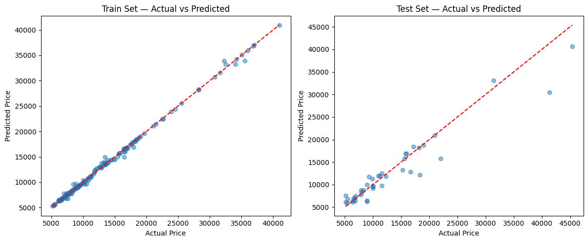
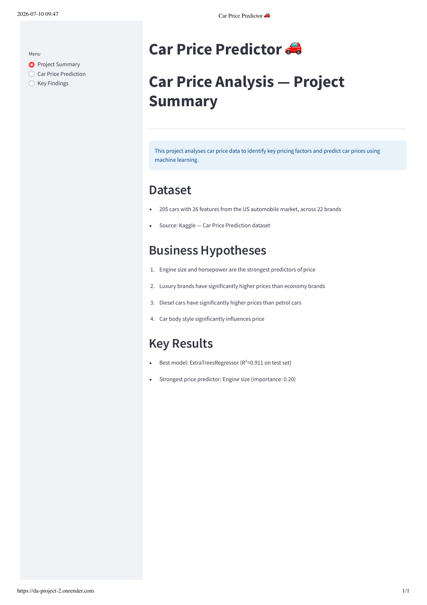
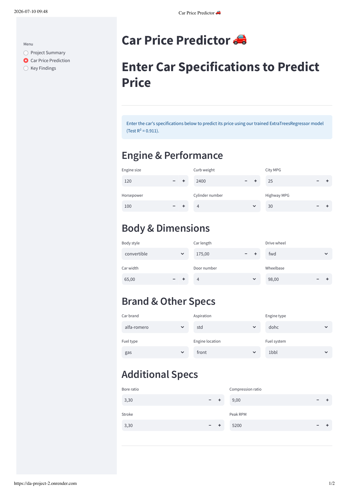
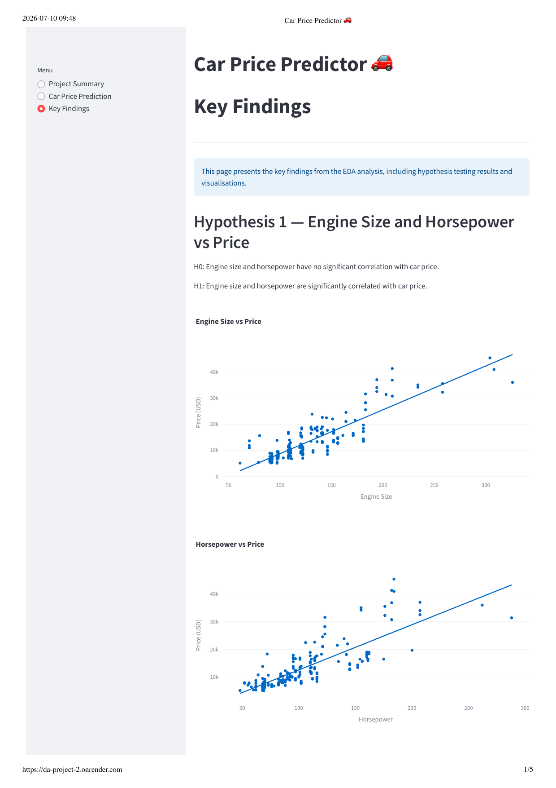
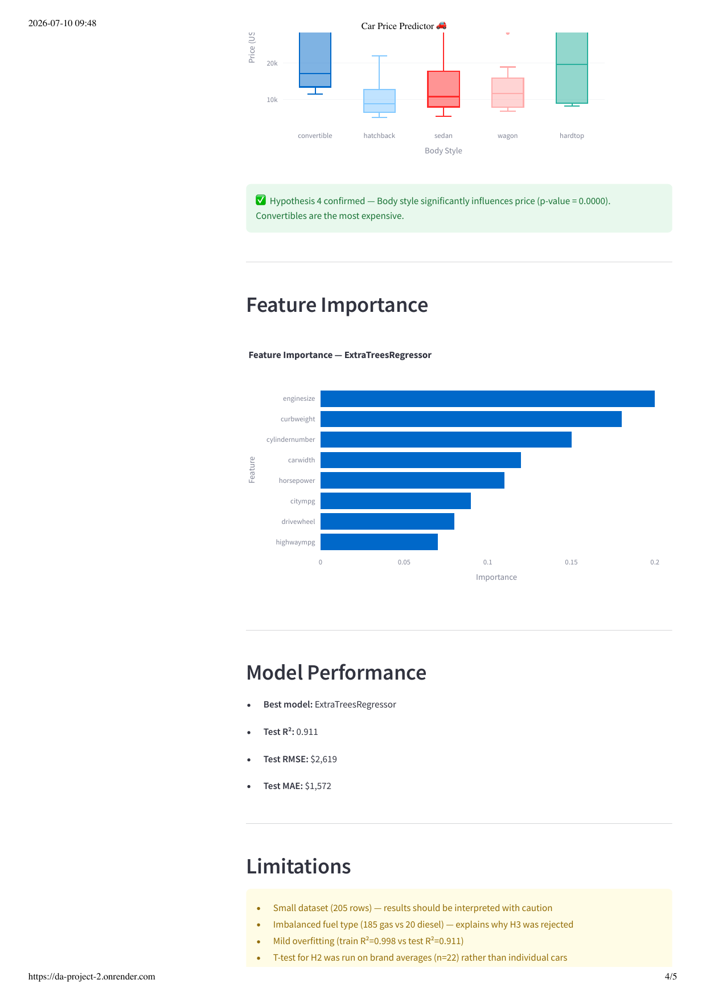
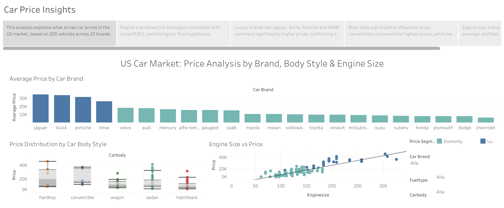

# Car Price Analysis — Capstone Unit 2

## Project Overview

This project analyses a car price dataset from the US automobile market 
to identify key pricing factors and build a machine learning model to 
predict car prices.

The project follows the CRISP-DM methodology and includes:
* ETL pipeline for data cleaning and feature engineering
* Exploratory data analysis with hypothesis testing
* Machine learning model (ExtraTreesRegressor, R²=0.911)
* Interactive Tableau dashboard for data storytelling
* Streamlit app for interactive price predictions

**Live App:** [Streamlit App](https://da-project-2.onrender.com)
**Tableau Dashboard:** [Car Price Analysis](https://public.tableau.com/shared/N6ZSWTY39?:display_count=n&:origin=viz_share_link)

---

## Table of Contents
1. [Project Overview](#project-overview)
2. [Dataset](#dataset)
3. [Business Requirements](#business-requirements)
4. [Business Hypotheses](#business-hypotheses)
5. [ML Business Case](#ml-business-case)
6. [ETL Pipeline](#etl-pipeline)
7. [EDA & Hypothesis Testing](#eda--hypothesis-testing)
8. [Machine Learning](#machine-learning)
9. [Dashboard & Visualisation](#dashboard--visualisation)
10. [Streamlit App](#streamlit-app)
11. [Dashboard Design (Wireframes)](#dashboard-design-wireframes)
12. [Testing & Validation](#testing--validation)
13. [Unfixed Bugs](#unfixed-bugs)
14. [Future Improvements](#future-improvements)
15. [Data Ethics & Privacy](#data-ethics--privacy)
16. [Project Management](#project-management)
17. [Technologies Used](#technologies-used)
18. [How to Run](#how-to-run)
19. [Reflection](#reflection)
20. [Credits](#credits)

---

## Dataset

* **Source:** [Kaggle — Car Price Prediction](https://www.kaggle.com/datasets/hellbuoy/car-price-prediction)
* **Size:** 205 rows, 26 columns
* **Target variable:** Price (USD)
* **Features:** Engine size, horsepower, curb weight, body style, car brand and more

### Data Dictionary
| Column | Description |
|---|---|
| CarName | Car brand and model name |
| fueltype | Fuel type (gas/diesel) |
| carbody | Body style (sedan, hatchback, etc.) |
| enginesize | Engine displacement |
| horsepower | Engine power output |
| curbweight | Weight of the car |
| price | Car price in USD (target variable) |

---

## Business Requirements

The client is a stakeholder in the US automobile market (e.g. a manufacturer 
or dealership) who wants to understand what drives car prices and be able 
to estimate a fair price for a car based on its specifications.

* **BR1:** The client wants to understand which car attributes have the 
  strongest relationship with price, so pricing and marketing decisions 
  can be informed by data rather than intuition.
  → Addressed via Hypotheses 1, 2 and 4, and the Feature Importance analysis.

* **BR2:** The client wants to know whether brand positioning (luxury vs 
  economy) and fuel type meaningfully affect price, to support brand 
  strategy and market segmentation decisions.
  → Addressed via Hypotheses 2 and 3.

* **BR3:** The client wants a tool to predict the price of a car given its 
  specifications, so that new or competitor models can be quickly 
  benchmarked without manual analysis.
  → Addressed via the Machine Learning model and the Streamlit prediction app.

* **BR4:** The client wants the findings communicated in an accessible, 
  interactive format that does not require technical or statistical 
  expertise to interpret.
  → Addressed via the Tableau dashboard and the Streamlit app's Key Findings page.

---

## Business Hypotheses

| Hypothesis | Result | p-value |
|---|---|---|
| H1: Engine size and horsepower are the strongest predictors of price | ✅ Partially confirmed | Correlation: 0.87 |
| H2: Luxury brands have significantly higher prices than economy brands | ✅ Confirmed | 0.0000 |
| H3: Diesel cars have higher prices than petrol cars | ❌ Rejected | 0.8659 |
| H4: Car body style significantly influences price | ✅ Confirmed | 0.0000 |

### Key Finding
Engine size (correlation: 0.87) is the strongest predictor of car price, 
followed by curbweight (0.84) and horsepower (0.81).

---

## ML Business Case

* **Aim:** Predict the price of a car (USD) based on its technical 
  specifications and attributes, to support BR3 (price benchmarking).

* **Learning method:** Supervised regression, since the target variable 
  (price) is continuous, not categorical.

* **Ideal outcome:** A model that predicts car price closely enough to be 
  useful for benchmarking (target: Test R² > 0.85).

* **Success metrics:**
  * Test R² ≥ 0.85
  * Test RMSE and MAE as low as reasonably possible given the small dataset

* **Model output:** A single predicted price (USD), with the model's Test 
  MAE (±$1,572) presented alongside each prediction as an indication of 
  expected error, so the client can interpret the result with appropriate 
  caution.

* **Heuristics:** Currently, pricing decisions in this context are likely 
  made using manual comparison to similar models or general market 
  knowledge — this project replaces that heuristic with a data-driven 
  estimate.

* **Training data:** The Kaggle Car Price Prediction dataset (205 rows, 
  26 columns), covering US automobile market listings. `price_per_horsepower` 
  and `price_per_enginesize` were excluded from training as they are 
  derived directly from the target variable and would cause data leakage.

* **Model selected:** ExtraTreesRegressor, chosen after testing five 
  algorithms and running hyperparameter optimisation via GridSearchCV 
  (see [Machine Learning](#machine-learning) for full detail).

---

## ETL Pipeline

### Extract
* Raw dataset loaded from Kaggle (205 rows, 26 columns)
* No missing values found

### Transform
* Ordinal encoding of cylindernumber and doornumber (text→integers)
* Price distribution analysed (mean $13,276, median $10,295, std $7,988)
* 15 price outliers identified using IQR method — retained as legitimate luxury vehicles

### Feature Engineering
* **price_per_horsepower** — cost efficiency relative to performance
* **price_per_enginesize** — cost relative to engine displacement
* Note: Both features excluded from ML to avoid data leakage

### Load
* Cleaned dataset saved to `outputs/datasets/cleaned/car_prices_cleaned.csv`

### Note
* CarBrand extraction and typo corrections are handled in the ML pipeline (03_ML.ipynb) 
  to ensure consistent transformations during model training and prediction

---

## EDA & Hypothesis Testing

### Statistical Methods Used
* Pearson correlation — to measure relationships between numerical variables
* Independent samples t-test (parametric) — to compare two groups
* One-way ANOVA (parametric) — to compare more than two groups

### Hypothesis Results

**H1 — Engine size and horsepower are the strongest predictors of price**
* Engine size correlation with price: 0.87
* Horsepower correlation with price: 0.81
* Unexpectedly, curbweight (0.84) outperformed horsepower
* Result: Partially confirmed ✅

**H2 — Luxury brands have significantly higher prices than economy brands**
* Brands above $20,000 average classified as luxury (Jaguar, Porsche, BMW, Buick)
* T-test p-value: 0.0000
* Result: Confirmed ✅

**H3 — Diesel cars have higher prices than petrol cars**
* Dataset imbalance: 185 gas vs 20 diesel cars
* Balanced sampling used (20 vs 20) for fair comparison
* T-test p-value: 0.8659
* Result: Rejected ❌

**H4 — Car body style significantly influences price**
* Convertibles have highest median price
* ANOVA p-value: 0.0000
* Result: Confirmed ✅

---

## Machine Learning

### Pipeline
* OrdinalEncoder — categorical variable encoding
* SimpleImputer — handles missing values
* StandardScaler — feature scaling
* SelectFromModel — automatic feature selection

### Algorithm Selection
Five regression algorithms were tested using a two-step search strategy:
1. Quick search with default hyperparameters
2. Extensive hyperparameter optimisation with GridSearchCV

### Best Model: ExtraTreesRegressor
* **Hyperparameters:** max_depth=10, min_samples_leaf=1, n_estimators=100
* **Train R²:** 0.998
* **Test R²:** 0.911
* **Test RMSE:** $2,619
* **Test MAE:** $1,572

### Feature Importance
| Feature | Importance |
|---|---|
| enginesize | 0.20 |
| curbweight | 0.18 |
| cylindernumber | 0.15 |
| carwidth | 0.12 |
| horsepower | 0.11 |
| citympg | 0.09 |
| drivewheel | 0.08 |
| highwaympg | 0.07 |

### Note on Overfitting
The gap between train R² (0.998) and test R² (0.911) indicates mild overfitting, 
partly expected given the small dataset size (205 rows).

### Target Variable Transformation
To address mild overfitting and right-skewed price distribution (skewness=1.78), 
four transformers were tested:

| Transformer | Mean R² (CV) |
|---|---|
| No transform | **0.9129** |
| PowerTransformer | 0.9125 |
| LogTransformer | 0.8971 |
| YeoJohnsonTransformer | 0.8918 |
| BoxCoxTransformer | 0.8914 |

No transformation improved model performance — tree-based models are inherently 
robust to skewness in the target variable.

### Actual vs Predicted Price



The scatter plots above compare actual vs predicted prices on both the 
train and test sets. Points closely follow the diagonal reference line 
on the train set, with slightly more spread on the test set — visually 
confirming the mild overfitting noted above (Train R²=0.998 vs Test 
R²=0.911).

---

## Dashboard & Visualisation

An interactive Tableau Public dashboard was built to communicate the key 
findings to a non-technical audience (supporting BR4).

**Live dashboard:** [Car Price Analysis](https://public.tableau.com/shared/N6ZSWTY39?:display_count=n&:origin=viz_share_link)

### Visualisations
* **Average Price by Car Brand** — bar chart showing all 22 brands, colour-coded 
  by Luxury vs Economy segment (threshold: mean average price > $20,000). 
  Directly visualises the result of Hypothesis 2.
* **Engine Size vs Price** — scatter plot with a linear trendline, colour-coded 
  by Price Segment, visualising the strongest predictor identified in Hypothesis 1.
* **Price Distribution by Car Body Style** — box plot showing price spread 
  across all five body styles, visualising the result of Hypothesis 4.

### Filters
Three interactive filters allow the user to explore the data by:
* Car Brand
* Fuel Type
* Body Style

### Story
A 5-point guided Story walks the user through the analysis narrative:
1. Introduction — overview of the dataset and analysis scope
2. Engine Size vs Price — Hypothesis 1 findings
3. Average Price by Car Brand — Hypothesis 2 findings
4. Price Distribution by Body Style — Hypothesis 4 findings
5. Summary — key takeaways and the full dashboard

---

## Streamlit App

A multi-page Streamlit app was built to let users explore the analysis and 
generate live price predictions (supporting BR3 and BR4), without needing 
to open the notebooks.

**Live App:** [Streamlit App](https://da-project-2.onrender.com)

The app has three pages, accessible via a sidebar menu:

### 1. Project Summary
Gives an overview of the project: dataset size and source, the four business 
hypotheses, and a short summary of the key model results (best model, Test R², 
strongest predictor).

### 2. Car Price Prediction
An interactive form where the user enters a car's specifications (engine size, 
horsepower, body style, brand, fuel type, and other technical attributes) and 
receives a predicted price from the trained ExtraTreesRegressor model. The 
predicted price is shown alongside the model's Test MAE (±$1,572), so the user 
understands the expected margin of error.

### 3. Key Findings
Presents the full EDA and ML results, organised by hypothesis:
* Each of the four hypotheses is shown with its H0/H1 statement, supporting 
  visualisation(s), and conclusion (confirmed / partially confirmed / rejected)
* Feature Importance chart (ExtraTreesRegressor)
* Model Performance metrics (R², RMSE, MAE)
* Limitations (small dataset, imbalanced fuel type, mild overfitting)
* Business Recommendations based on the findings

### Data & Model Loading
The app loads the cleaned dataset (`outputs/datasets/cleaned/car_prices_cleaned.csv`) 
and the trained model/encoder (`outputs/models/car_price_model.pkl`, `encoder.pkl`) 
directly, using the same CarBrand extraction and typo-correction logic as the 
ML notebook, to ensure predictions and findings stay consistent with the 
underlying analysis.

---

## Dashboard Design (Wireframes)

This section outlines the layout and content of each Streamlit page and the 
Tableau dashboard.

### Streamlit — Project Summary
* Page title and short project description (`st.info`)
* Dataset section — size, source
* Business Hypotheses — numbered list
* Key Results — best model, R², strongest predictor

  

### Streamlit — Car Price Prediction
* Page title and instructions (`st.info`)
* Input form grouped into four sections: *Engine & Performance*, 
  *Body & Dimensions*, *Brand & Other Specs*, *Additional Specs*
* "Predict Price" button
* Predicted price displayed with the model's expected margin of error (MAE)

  

### Streamlit — Key Findings
* Page title and short intro (`st.info`)
* One subsection per hypothesis (H1–H4), each containing:
  * H0/H1 statement
  * Supporting chart(s)
  * Confirmed / partially confirmed / rejected result (colour-coded)
* Feature Importance chart
* Model Performance summary
* Limitations
* Business Recommendations

  
 


### Tableau Dashboard
* Dashboard title, full-width bar chart (Average Price by Car Brand) on the 
  top row
* Box plot (Price Distribution by Body Style) and scatter plot 
  (Engine Size vs Price) side by side on the second row
* Filters (Car Brand, Fuel Type, Body Style) and colour legends (Price 
  Segment, Body Style) positioned to the right
* A separate guided Story with 5 points walks the user through the 
  dashboard's key insights



---

## Testing & Validation

### Code Validation
All Python files (`app.py` and `app_pages/*.py`) were validated using the 
official Code Institute PEP8 validator ([pep8ci.herokuapp.com](https://pep8ci.herokuapp.com/#)), 
with no errors found.

### Notebook Validation
All three Jupyter notebooks (`01_ETL_Pipeline.ipynb`, `02_EDA.ipynb`, 
`03_ML.ipynb`) were run from start to finish using "Restart & Run All", 
confirming they execute without errors in a fresh kernel session.

During this process, a bug was identified and fixed in `02_EDA.ipynb`: 
the `CarBrand` column (used throughout the hypothesis testing) was not 
being created within the notebook itself, since brand extraction had 
been moved to `03_ML.ipynb` per earlier lecturer feedback. A dedicated 
`CarBrand` extraction cell was added early in `02_EDA.ipynb`, ensuring 
each notebook remains independently runnable without relying on 
variables created elsewhere.

### Manual Testing — Car Price Prediction

The prediction form was manually tested with four input scenarios to 
confirm the app handles a range of inputs without errors:

| Test | Input | Expected Result | Actual Result | Pass/Fail |
|---|---|---|---|---|
| Standard car | Default form values | Reasonable price, no crash | $10,057.90 | ✅ Pass |
| Luxury car | Jaguar, enginesize=300, horsepower=250, convertible | High price expected | $15,993.40 | ✅ Pass |
| Economy car | Chevrolet, small engine/horsepower, hatchback | Low price (<$10,000) | $8,698.42 | ✅ Pass |
| Minimum values | All numeric fields at their minimum | No crash, reasonable output | $9,065.57 | ✅ Pass |

**Note:** The Luxury car test produced a lower price than expected for 
a "fully loaded" luxury convertible. This revealed that `CarBrand` and 
`carbody` are not among the 8 features selected by `SelectFromModel` 
during training (see [Feature Importance](#machine-learning)) — 
predictions are driven primarily by engine size, curb weight, cylinder 
number, car width, horsepower, and MPG figures, rather than brand or 
body style directly. This is documented as a known model characteristic 
rather than a bug.

---

## Unfixed Bugs

No unfixed bugs remain at the time of submission.

During development, one bug was identified and fixed: a missing 
`CarBrand` extraction step in `02_EDA.ipynb` (see 
[Testing & Validation](#testing--validation) for details).

---

## Future Improvements

* **More data:** Collecting a larger, more balanced dataset (particularly 
  more diesel car samples) would allow Hypothesis 3 to be tested more 
  reliably, and could reduce the mild overfitting observed in the ML model.
* **Additional features:** Incorporating features not present in this 
  dataset (e.g. manufacturing year, mileage, condition) could improve 
  prediction accuracy for real-world use cases.
* **Broader market coverage:** The current dataset only covers the US 
  market. Expanding to include European or Asian car markets would 
  make the model more broadly applicable.
* **Deployment scalability:** As currently deployed on a free-tier 
  hosting service, the app may be slow to "wake up" after inactivity. 
  Upgrading to a paid tier or optimising cold-start time would improve 
  user experience for a production use case.

---

## Data Ethics & Privacy

This project uses a publicly available Kaggle dataset containing no 
personally identifiable information. All data relates to anonymised 
vehicle specifications, not individuals.

---

## Project Management

Project tasks were planned and tracked using a GitHub Projects Kanban 
board (`DA_project_2_CarPrices`), with issues organised into five 
columns: **Backlog**, **Ready**, **In Progress**, **In Review**, and 
**Done**.

Each major project deliverable was tracked as its own issue, for example:
* #1 Set up project structure and dependencies
* #2 ETL Pipeline — Extract, Transform, Load
* #3 EDA — Exploratory Data Analysis
* #5 Tableau Dashboard
* #6 Streamlit App — Interactive Price Predictor
* #7 Documentation — README and Reflections

This board-based workflow made it possible to track progress across the 
project's CRISP-DM phases and ensure each deliverable was completed 
before moving on to the next.

---

## Technologies Used

### Languages
* Python
* Markdown

### Data Analysis & Machine Learning
* Pandas — data manipulation and cleaning
* NumPy — numerical operations
* Scikit-learn — machine learning pipeline, model selection, evaluation
* Feature-engine — ordinal encoding, target variable transformers
* SciPy — statistical hypothesis testing (t-tests, ANOVA)
* Joblib — saving/loading the trained model and encoder

### Data Visualisation
* Matplotlib & Seaborn — statistical plots in notebooks
* Plotly Express — interactive charts in notebooks and the Streamlit app
* Tableau Public — interactive dashboard and guided Story

### Development & Deployment
* Jupyter Notebook — ETL, EDA, and ML development
* Streamlit — interactive multi-page web app
* Render — app hosting/deployment
* Visual Studio Code — code editor
* Git & GitHub — version control
* GitHub Projects — Kanban board for task/project management

### Validation
* pycodestyle / Code Institute PEP8 Validator — Python code style validation

### Data Source
* [Kaggle — Car Price Prediction](https://www.kaggle.com/datasets/hellbuoy/car-price-prediction)

---

## How to Run

### Prerequisites
* Python 3.11
* Git

### Setup

1. Clone the repository:
```bash
   git clone https://github.com/tildeholmqvist/DA_project_2.git
   cd DA_project_2
```

2. Create and activate a virtual environment:
```bash
   python3 -m venv .venv
   source .venv/bin/activate
```

3. Install dependencies:
```bash
   pip install -r requirements.txt
```

### Running the Notebooks

The three Jupyter notebooks are located in `jupyter_notebooks/` and should 
be run in order:
1. `01_ETL_Pipeline.ipynb` — cleans the raw data and saves the cleaned 
   dataset to `outputs/datasets/cleaned/`
2. `02_EDA.ipynb` — performs exploratory analysis and hypothesis testing
3. `03_ML.ipynb` — trains the ML model and saves it to `outputs/models/`

Each notebook includes a "Change working directory" step near the top 
that should only be run once per kernel session.

### Running the Streamlit App Locally

```bash
streamlit run app.py
```

The app will open at `http://localhost:8501`.

### Deployment (Render)

The app was deployed to Render instead of Heroku, since the Heroku 
student tier was not accessible at the time of deployment. The trained 
model (`outputs/models/car_price_model.pkl`) is served through a 
[Streamlit](https://streamlit.io/) web app, deployed to 
[Render](https://render.com/) using a Docker image. Render builds the 
`Dockerfile` in the repository root, runs the container, and exposes it 
on a public HTTPS URL.

**Deploy steps:**
1. Push the repository (including the `Dockerfile`, `app.py`, and the 
   trained `.pkl` model) to GitHub.
2. Sign in to the [Render Dashboard](https://dashboard.render.com/) and 
   click **New → Web Service**.
3. Connect the GitHub account and select the repository.
4. Configure the service:
   * Language / Runtime: `Docker` (Render auto-detects the `Dockerfile`)
   * Branch: `main`
   * Instance Type: Free plan (note: free services spin down after 
     inactivity and cold-start on the next request)
5. Render automatically injects a `PORT` environment variable — the 
   Dockerfile binds Streamlit to it, so no extra configuration is 
   required.
6. Click **Create Web Service**. Render builds the Docker image, starts 
   the container, and publishes the app at 
   `https://da-project-2.onrender.com`.
7. Every push to `main` triggers an automatic rebuild and redeploy.

**Live App:** [https://da-project-2.onrender.com](https://da-project-2.onrender.com)

---

## Reflection

This project involved learning and applying several tools for the first 
time, which required adapting quickly and troubleshooting along the way.

**New tools and methodologies:**
Tableau Public and Streamlit were both new to me at the start of this 
course. Building the Tableau dashboard required learning concepts such 
as calculated fields, LOD expressions, dashboard actions, and the Story 
feature for guided narratives, skills I had not used before. Similarly, 
structuring a multi-page Streamlit app and connecting it to a trained 
scikit-learn pipeline required understanding how to load and reuse a 
saved model (`joblib`) consistently across notebooks and app code.

**Challenges faced and how they were overcome:**
* *Duplicate output folders:* Running notebook cells out of order (before 
  restarting the kernel) caused an `outputs/` folder to be created in the 
  wrong directory. I diagnosed this by comparing folder contents with 
  `diff`, confirmed the correct files, and removed the duplicate.
* *A silent bug in `02_EDA.ipynb`:* Running "Restart & Run All" revealed 
  that `CarBrand` was being used in hypothesis testing without ever being 
  created in that notebook, it had only appeared to work previously 
  because it had been created earlier in the same kernel session by 
  another notebook. I fixed this by adding an explicit extraction step, 
  which also taught me to always test notebooks with a full kernel 
  restart rather than assuming cell execution order.
* *PEP8 compliance:* My initial code had multiple line-length and spacing 
  violations, identified using the Code Institute PEP8 validator. Fixing 
  these systematically improved the overall readability of the codebase.
* *AI tooling:* GitHub Copilot did not integrate reliably in my 
  development environment, so I adapted by using Claude as my primary 
  AI assistant for debugging, code review, and implementation guidance 
  throughout the project (see Credits for details), as well as ChatGPT.

**How this project prepared me for future work:**
Working across three connected deliverables (Jupyter notebooks, a 
Tableau dashboard, and a deployed Streamlit app) taught me the 
importance of keeping data transformations consistent across every 
tool that touches the same dataset, a small inconsistency in one place 
(like the CarBrand bug) can silently break something built on top of it. 
I also became more comfortable using a Kanban board (GitHub Projects) to 
break a large project into manageable, trackable tasks, which is a 
workflow I intend to continue using in future data analytics projects.

---

## Credits

### Dataset
* [Car Price Prediction Dataset](https://www.kaggle.com/datasets/hellbuoy/car-price-prediction?resource=download) by hellbuoy on Kaggle

### AI Assistance
* GitHub Copilot was initially used but did not integrate reliably in 
  this development environment; Claude (Anthropic) was used as the 
  primary AI assistant throughout the project instead.
* Claude was used for: debugging code errors, guidance on Tableau and 
  Streamlit implementation as well as the Car Price Prediction page, 
  code review against PEP8 standards, and documentation support.
* ChatGPT (OpenAI) was primarily used for guidance during parts of the 
  development process.
* All hypotheses, analytical interpretations, business reasoning, data 
  cleaning decisions, and the underlying notebooks are the author's own.

### Code
* Much of the underlying code structure — including the multi-page 
  Streamlit app template (`multi_page.py`, `app.py`), the ETL/EDA/ML 
  notebook workflow, the scikit-learn pipeline pattern, and the 
  hyperparameter search class — is adapted from Code Institute LMS 
  walkthrough lessons and templates, applied to this project's own 
  dataset, hypotheses, and analysis.

### Acknowledgements
* Code Institute LMS — course material and project template
* Marcel (mentor) — guidance throughout the project

---